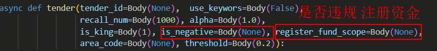

# 日常工作总结报告

## 日期： 2024年4月15日

## 工作概述

- 在此次工作日中，主要的工作内容包含学习celery中对定时任务的定义及调度方式。

## 任务详述

### 任务1：学习celery中对定时任务的定义及调度方式

- **任务描述**：
  - 学习celery对定时任务的调度方式和周期任务调度方式
- **完成情况**：
  - 包括对定时任务的定义，其包括`固定时间`和`定时延迟`两种方式来实现
  - 实现多级目录下的定时任务调度方式及结果查询
  - 实现多级目录下的周期任务调度方式
    - 理解周期任务的调度方式：`beat`方式启动celery会按周期任务定义插入任务至celery队列但不执行，启动`worker`后才执行插入的队列任务。
  - 具体笔记可见：[StudyNote4Jalen/yzw@program/ai-webapi/celery.md at main · Jalen-Zhong/StudyNote4Jalen (github.com)](https://github.com/Jalen-Zhong/StudyNote4Jalen/blob/main/yzw@program/ai-webapi/celery.md)
  - 学习[不规范的celery项目目录结构的celery的使用](https://github.com/ydf0509/celery_demo)
- **赞成和挑战**：
  - `datetime.utcfromtimestamp`不支持使用，替换为`datetime.fromtimestamp`后延时任务不执行，其原因在于当前电脑使用的时区为中国上海时区，为UTC+8时。解决方式为`time - 8`
- **延期/挂起的问题**：
  - 如何查询历史遗留任务
  - 如何启动自定义worker对celery队列任务的并发处理数量
  - 如何清空历史遗留任务

### 任务2：初次接手谷老师的项目

- **任务描述**：
  - 与涂老师一起查看业务需求与对应项目代码实现，找出未实现业务功能。
- **完成情况**：
  - 谷老师项目中关注`商机大厅需求`中`招募推荐规则`和`会员潜客名单推荐`两类需求。正在看对应项目代码。
- **赞成和挑战**：
  - 大致看函数定义，两个需求都有涉及，`会员潜客名单推荐`：
  - 可看到需求对应的大致代码，但是否完成业务需求还需要细看代码
- **延期/挂起的问题**：
  - 召回的过程中不涉及的参数涂老师似乎做了空白处理，返回的数据流与供应商特征做特征匹配计算相似度，需求里的判断似乎都是在模型中完成的，所以没有看到大量的判断语句。需要和涂老师讨论相关问题。

## 下一步行动计划

### 行动1：

- 继续看需求和代码

### 需要的协助：

- 需求和代码对应理解下来有点混乱，将列出问题和涂老师讨论

## 其他注意事项

- 无